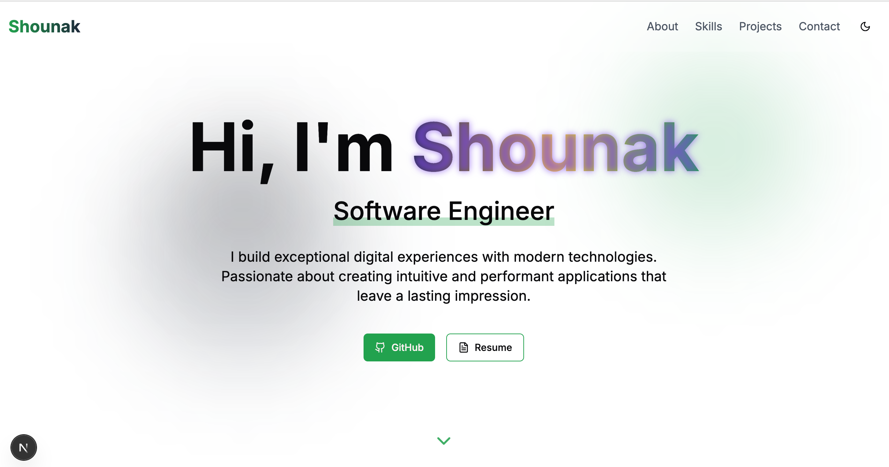

# 🌐 Shounak's Portfolio

Welcome to my personal developer portfolio!  
Built with modern web technologies, this site showcases who I am, what I do, and the projects I've worked on.

## 🚀 About Me

I’m **Shounak**, a passionate Software Engineer currently working at [Pathao Ltd.](https://pathao.com), one of Bangladesh’s leading digital platforms. I specialize in building user-centric web applications, designing seamless interfaces, and solving complex engineering problems with clean code.

## 🛠️ Tech Stack

- **Frontend:** React.js, Next.js, Vue.js, Tailwind CSS, Framer Motion  
- **Backend:** Node.js, Express.js, Firebase, REST APIs  
- **Database:** MySQL, MongoDB  
- **Tools:** Git, Vercel, VS Code, Postman, Figma  

## 📁 Features

- 🔥 Animated landing section with gradient text and motion effects  
- 📱 Fully responsive UI optimized for all screen sizes  
- 💼 Filterable project showcase with hover animations  
- 📝 Clean, bullet-pointed experience & education timeline  
- 📬 Contact form integrated via EmailJS  
- 🌐 SEO optimized for better visibility

## 📸 Preview



## 🌍 Live Site

[https://your-portfolio-url.com](https://ssraj.vercel.app)  
_Deployed via Vercel_

## 🧩 Folder Structure

```
.
├── components/
├── app/
├── public/
├── styles/
├── utils/
├── data/          # Experience, education, projects, skills
└── README.md
```

## 📩 Contact

Feel free to reach out through the contact form or connect with me:

- Email: shounaksarker@gmail.com  
- LinkedIn: [linkedin.com/in/shounaksarker](https://linkedin.com/in/shounaksarker)  
- GitHub: [github.com/shounaksarker](https://github.com/shounaksarker)

---

> Designed & built by Shounak — with ❤️ and clean code.
